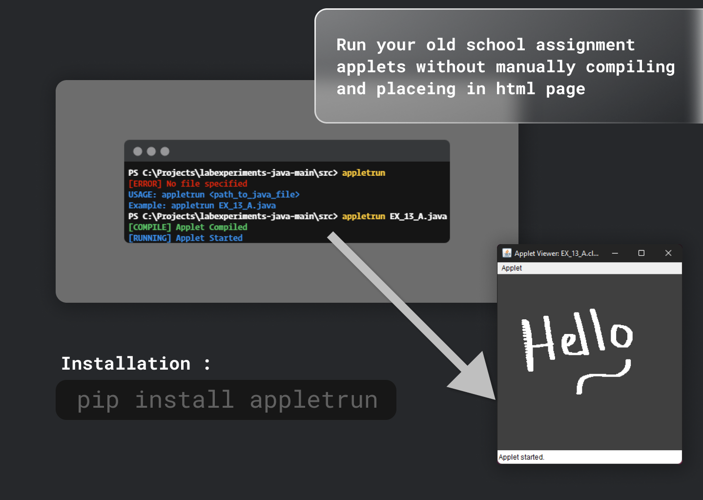

# APPLETRUN


AppletRun runs applet code from given java file in a new window
<p align="center">

 </p>

## 👉 Installation

```
pip install appletrun
```

if not working try `python -m pip install appletrun` or `python3 -m pip install appletrun`

## 👉 Usage

```
 appletrun nameOfFile.java
```

<p align="center">

 </p>

## 👉 Issues

If you find any bugs ? or have an issue ? post here
https://github.com/Royal-lobster/appletrun-python/issues
